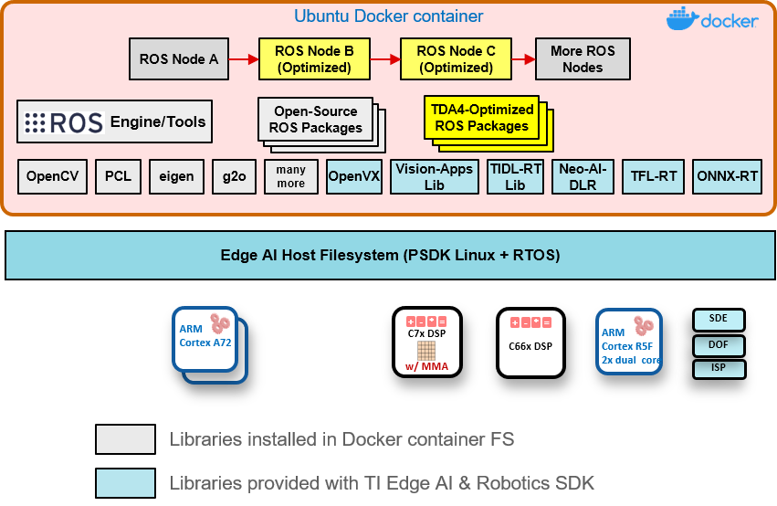
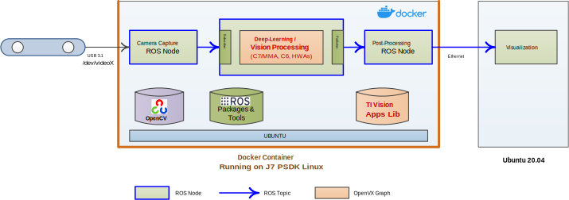
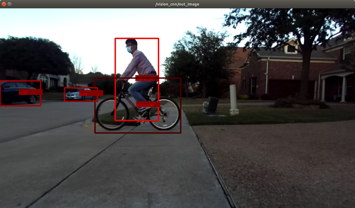
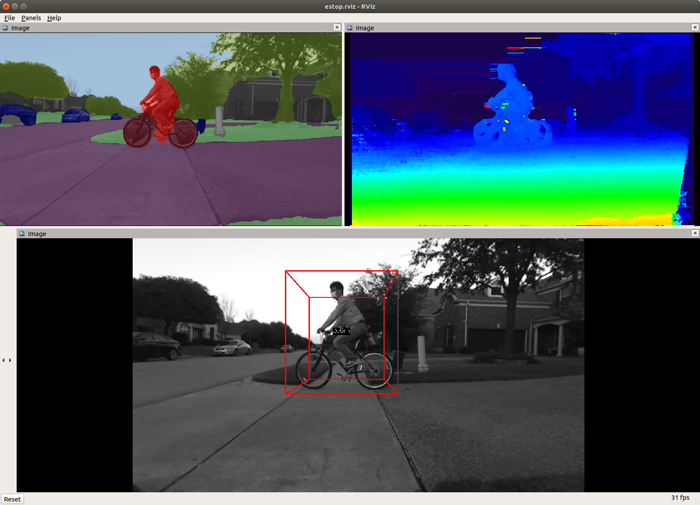
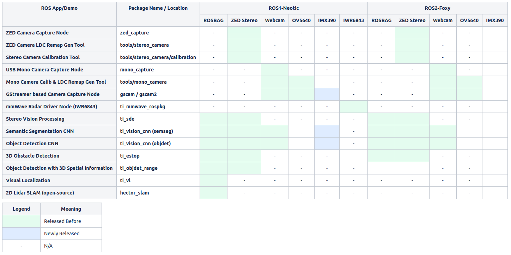

Robotics SDK
============

## Git Repository

[Robotics SDK Git Repository](https://git.ti.com/cgit/processor-sdk-vision/jacinto_ros_perception/about/)

[User Guide Documentation](https://software-dl.ti.com/jacinto7/esd/robotics-sdk/08_04_00/docs/index.html)

## Overview

The Jacinto Robotics SDK provides software development environment on the latest TDA4 class of SoCs, and also provides software building blocks and example demos that can be leveraged in robotics software development. The SDK runs in Docker container environments on [Processor SDK Linux for Edge AI 8.4.0](https://www.ti.com/tool/download/PROCESSOR-SDK-LINUX-SK-TDA4VM/08.04.00.10). We provide detailed steps for setting up Docker container environments for ROS Noetic and ROS 2 Foxy on the Processor SDK Linux for Edge AI (see next section). The Robotics SDK allows:

* Optimized software implementation of computation-intensive software blocks (including deep-learning, vision, perception, mapping and localization) on deep-learning core (C7x/MMA), DSP cores, hardware accelerators built-in on the TDA4 processors.
* Application software development on the target using APIs optimized on the TDA4 cores and hardware accelerators along with many open-source libraries and packages including, for example, OpenCV, Point-Cloud Library (PCL), and many more.

Figure 1 shows the software libraries and components that the Robotics SDK provides.

 <figcaption>Figure 1. Robotics Software Development Kit: Software Stack </figcaption>
  

### TI Vision Apps Library
TI Vision Apps Library is included in the pre-built base image for the Processor SDK Linux for Edge AI. The library provides a set of APIs including:

* TI OpenVX kernels and software infrastructure
* Imaging and vision applications
* Perception applications
* Advanced driver-assistance systems (ADAS) applications

### Open-Source Deep-Learning Runtime
The Processor SDK Linux for Edge AI also supports the following open-source deep-learning runtime:
* TVM/Neo-AI-DLR
* TFLite Runtime
* ONNX Runtime

For more details on open-source deep-learning runtime on TDA4x, please check [TI Edge AI Cloud](https://dev.ti.com/edgeai/). The Robotics SDK provides a versatile vision CNN node optimized on TDA4x that supports many deep-learning models for object detection and semantic segmentation operations.

Figure 2 shows a representative deep-learning and compute-intensive demo application developed with the Robotics SDK.

<figcaption>Figure 2. Example Demo Application with Robotics SDK </figcaption>
 

## Setting Up Robotics SDK Docker Container Environment

This section describes how to set up the Robotics SDK on top of the Processor SDK Linux for Edge AI. Check out our [Setting Up Robotics SDK](docker/README.md) to get started.

**Note**: git.ti.com has some issue in rendering markdown files. We highly recommend to use [the section in the User Guide Documentation](https://software-dl.ti.com/jacinto7/esd/robotics-sdk/08_04_00/docs/source/docker/README.html#setting-up-robotics-kit-environment)

## Sensor Driver Nodes

Following ROS nodes for cameras are tested and supported by the SDK.

### [USB Stereo Camera Capture Node for ZED Cameras](ros1/drivers/zed_capture/README.md)

### [USB Mono Camera Capture Node](ros1/drivers/mono_capture/README.md)

### [GStreamer-based Camera Capture Node](ros1/drivers/gscam/README_TI.md)

### [mmWave Radar Driver Node](docs/radar_driver_node.md)

## Demo Applications

The SDK supports following out-of-box demo applications.

### [Stereo Vision Processing Accelerated on LDC and SDE](ros1/nodes/ti_sde/README.md)

### [Semantic Segmentation CNN Accelerated on C7x/MMA](ros1/nodes/ti_vision_cnn/README.md)

### [Object Detection CNN Accelerated on C7x/MMA](ros1/nodes/ti_vision_cnn/README_objdet.md)

### [3D Obstacle Detection Accelerated on SDE and C7x/MMA](ros1/nodes/ti_estop/README.md)

### [Vision Object Detection with 3D Spatial Information](ros1/nodes/ti_objdet_range/README.md)

### [Visual Localization Accelerated on C7x/MMA](ros1/nodes/ti_vl/README.md)

<figcaption>Figure 3. Demo Application Examples </figcaption>
 

## Scope of Robotics SDK

## Limitations and Known Issues
See [known_issues.md](docs/known_issues.md)

## Change Log
See [CHANGELOG.md](CHANGELOG.md)

## Questions & Feedback

If you have questions or feedback, please use [TI E2E](https://e2e.ti.com/support/processors).
