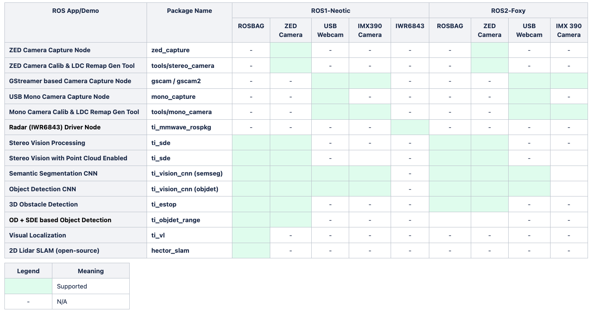

# Robotics SDK Introduction

## Git Repository

[Robotics SDK Git Repository](https://git.ti.com/cgit/processor-sdk-vision/jacinto_ros_perception/about/)

## User Guide Documentation
- [TDA4VM](https://software-dl.ti.com/jacinto7/esd/robotics-sdk/08_06_01/TDA4VM/docs/index.html)
- [AM68A](https://software-dl.ti.com/jacinto7/esd/robotics-sdk/08_06_01/AM68A/docs/index.html)
- [AM69A](https://software-dl.ti.com/jacinto7/esd/robotics-sdk/08_06_01/AM69A/docs/index.html)

## Overview

The Jacinto Robotics SDK provides a robotics software development environment for the latest TDA4 class of SoCs. It also offers software building blocks and example demos that can be leveraged in robotics software development. The SDK runs in Docker container environments on:

- [Processor SDK Linux for TDA4VM 8.6.1](https://www.ti.com/tool/download/PROCESSOR-SDK-LINUX-SK-TDA4VM)
- [Processor SDK Linux for AM68A 8.6.1](https://www.ti.com/tool/download/PROCESSOR-SDK-LINUX-AM68A)
- [Processor SDK Linux for AM69A 8.6.1](https://www.ti.com/tool/download/PROCESSOR-SDK-LINUX-AM69A)

In the next section, you will find detailed steps for setting up Docker container environments for ROS Noetic and ROS 2 Foxy on the Processor SDK Linux for Edge AI. The Robotics SDK allows:

- Optimized software implementation of computation-intensive software building blocks (including deep-learning, vision, perception, mapping and localization) on deep-learning core (C7x/MMA), DSP cores, hardware accelerators built-in on the TDA4 processors.
- Application software development on the target using libraries optimized on the TDA4 cores and hardware accelerators along with many open-source libraries and packages including, for example, OpenCV, Point-Cloud Library (PCL), and more.

Figure 1 shows the software libraries and components provided by the Robotics SDK.

 <figcaption>Figure 1. Robotics Software Development Kit: Software Stack </figcaption>
  

### TI Vision Apps Library

The TI Vision Apps Library is included in the pre-built base image for the Processor SDK Linux for Edge AI. The library provides a set of APIs, including:

- TI OpenVX kernels and software infrastructure
- Imaging and vision applications
- Perception applications
- Advanced driver-assistance systems (ADAS) applications

### Open-Source Deep-Learning Runtime

The Processor SDK Linux for Edge AI also supports the following open-source deep-learning runtime libraries:
- TVM/Neo-AI-DLR
- TFLite Runtime
- ONNX Runtime

For more details on open-source deep-learning runtime on TDA4x, please check [TI Edge AI Cloud](https://dev.ti.com/edgeai/). The Robotics SDK provides a versatile vision CNN node optimized for TDA4x that supports many deep-learning models for object detection and semantic segmentation operations.

Figure 2 shows a representative deep-learning and compute-intensive demo application developed with the Robotics SDK.

<figcaption>Figure 2. Example Demo Application with Robotics SDK </figcaption>
 

## Setting Up Robotics SDK Docker Container Environment

This section describes how to set up the Robotics SDK on top of the Processor SDK Linux for Edge AI. To get started, please refer to our [Setting Up Robotics SDK](docker/README.md) guide.

## Sensor Driver Nodes

The following ROS nodes for cameras have been tested and are supported by the SDK:

- [USB Stereo Camera Capture Node for ZED Cameras](ros1/drivers/zed_capture/README.md)
- [USB Mono Camera Capture Node](ros1/drivers/mono_capture/README.md)
- [GStreamer-based Camera Capture Node](ros1/drivers/gscam/README_TI.md)
- [mmWave Radar Driver Node](docs/radar_driver_node.md)
- [RealSense Camera Node](docs/realsense_driver_node.md)

## Demo Applications

The SDK supports the following out-of-box demo applications:

- [Stereo Vision Processing Accelerated on LDC and SDE](ros1/nodes/ti_sde/README.md)
- [Semantic Segmentation CNN Accelerated on C7x/MMA](ros1/nodes/ti_vision_cnn/README.md)
- [Object Detection CNN Accelerated on C7x/MMA](ros1/nodes/ti_vision_cnn/README_objdet.md)
- [3D Obstacle Detection Accelerated on SDE and C7x/MMA](ros1/nodes/ti_estop/README.md)
- [Vision Object Detection with 3D Spatial Information](ros1/nodes/ti_objdet_range/README.md)
- [Visual Localization Accelerated on C7x/MMA](ros1/nodes/ti_vl/README.md)
- [2D Lidar SLAM (open-source)](ros1/slam/README.md)
- [AprilTag Detection (open-source)](docs/april_tag.md)

<figcaption>Figure 3. Demo Application Examples </figcaption>
 

## Scope of Robotics SDK

## Limitations and Known Issues

See [known_issues.md](docs/known_issues.md) for a list of limitations and known issues.

## Change Log

See [CHANGELOG.md](CHANGELOG.md) for the change log.

## Questions & Feedback

If you have any questions or feedback, please visit [TI E2E](https://e2e.ti.com/support/processors).
