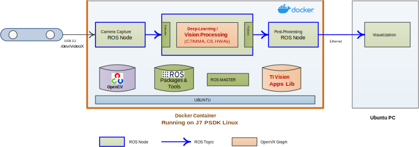

Robotics SDK: Intoduction
=========================
## Git Repository

[Robotics SDK Git Repository](https://git.ti.com/cgit/processor-sdk-vision/jacinto_ros_perception/about/)

[User Guide Documentation](https://software-dl.ti.com/jacinto7/esd/robotics-sdk/00_05_00_01/docs/index.html)
## Overview

The Jacinto Robotics SDK provides software development environment on the latest TDA4 class of SoCs, and also provides software building blocks and example demos that can be leaveraged in robotics software development. The SDK runs in Docker container environments on [Processor SDK Linux for Edge AI](https://www.ti.com/tool/download/PROCESSOR-SDK-LINUX-SK-TDA4VM#release-notes). We provide detailed steps for setting Docker container environments for ROS Melodic and ROS 2 Foxy on the Processor SDK Linux (see next section). The Robotics SDK allows:

* Optimized software implementation of computation-intensive software blocks (including deep-learning, vision, perception, and ADAS) on deep-learning core (C7x/MMA), DSP cores, hardware accelerators built-in on the TDA4 processors.
* Application software can be complied directly on the target using APIs optimized on the TDA4 cores and hardware accelerators along with many open-source libraries and packages including, for example, OpenCV, Point-Cloud Library (PCL), and many more.

 <figcaption>Figure 1. TI Robotics Software Development Kit: Software Stack </figcaption>
  

Figure 1 shows the software libraries and components that the Robotics SDK provides.
### TI Vision Apps Library
TI Vision Apps Library is included in the pre-built base image for [Processor SDK Linux for Edge AI](https://www.ti.com/tool/download/PROCESSOR-SDK-LINUX-SK-TDA4VM#release-notes). The library provides a set of APIs including:

* TI OpenVX kernels and infrastructure
* Imaging and vision applications
* Advanced driver-assistance systems (ADAS) applications
* Perception applications

### Open-Source Deep-Learning Runtime
The Processor SDK Linux for Edge AI also supports the following open-source deep-learning runtime:
* TVM/Neo-AI-DLR
* TFLite Runtime
* ONNX Runtime

For more details on open-source deep-learning runtime on TDA4x, please check [TI Edge AI Cloud](https://dev.ti.com/edgeai/). The Robotics SDK provides a versitile vision CNN node optimized  on TDA4x that supports many deep-learning models for object detection and semantic segmentation operations.

Figure 2 shows a representative deep-learning and compute-intensive application developed with the Robotics SDK.

<figcaption>Figure 2. Example Application with Robotics SDK </figcaption>
 

## Setting Up Robotics SDK Docker Container Environment

See [Setting Up Robotics SDK Environment](docker/README.md)

**Note**: git.ti.com has some issue in rendering markdown files. We highly recommend to use [the section in the User Guide Documentation](https://software-dl.ti.com/jacinto7/esd/robotics-sdk/00_05_00_01/docs/source/docker/README.html#setting-up-robotics-kit-environment)

## Sensor Driver Nodes
### [USB Stereo Camera Capture Node for ZED Cameras](drivers/zed_capture/README.md)

### [USB Mono Camera Capture Node](drivers/mono_capture/README.md)

## Demo Applications

<figcaption>Figure 3. Demo Applications </figcaption>
 

### [Stereo Vision Processing Accelerated on LDC and SDE](ros1/nodes/ti_sde/README.md)

### [Semantic Segmentation CNN Accelerated on C7x/MMA](ros1/nodes/ti_vision_cnn/README.md)

### [Object Detection CNN Accelerated on C7x/MMA](ros1/nodes/ti_vision_cnn/README_objdet.md)

### [3D Obstacle Detection Accelerated on SDE and C7x/MMA](ros1/nodes/ti_estop/README.md)

### [Visual Localization Accelerated on C7x/MMA](ros1/nodes/ti_vl/README.md)

## Change Log
See [CHANGELOG.md](CHANGELOG.md)
## Limitations and Known Issues

1. RViz visualization is displayed on a remote Ubuntu PC.
2. Ctrl+C termination of a ROS node or a ROS launch session can be sometimes slow.
3. Stereo Vision Demo
    * Output disparity map may have artifacts that are common to block-based stereo algorithms. e.g., noise in the sky, texture-less area, repeated patterns, etc.
    * While the confidence map from SDE has 8 values between 0 (least confident) to 7 (most confident), the confidence map from the multi-layer SDE refinement has only 2 values, 0 and 7. Therefore, it would not appear as fine as the SDE's confidence map.
4. The default semantic segmentation model used in `ti_vision_cnn` and `ti_estop` nodes was trained with Cityscapes dataset first, and  re-trained with a small dataset collected from a particular stereo camera (ZED camera, HD mode) for a limited scenarios with coarse annotation. Therefore, the model can show limited accuracy performance if a different camera model is used and/or when it is applied to different environment scenes.

## Questions & Feedback

If you have questions or feedback, please use [TI E2E](https://e2e.ti.com/support/processors).
