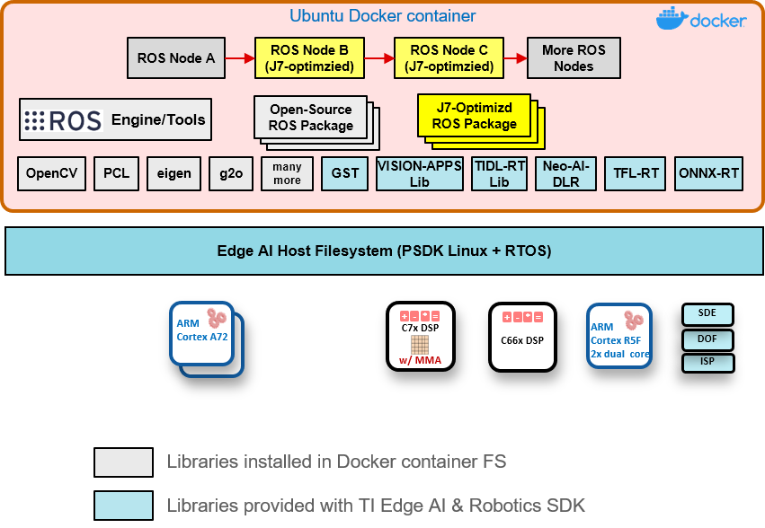
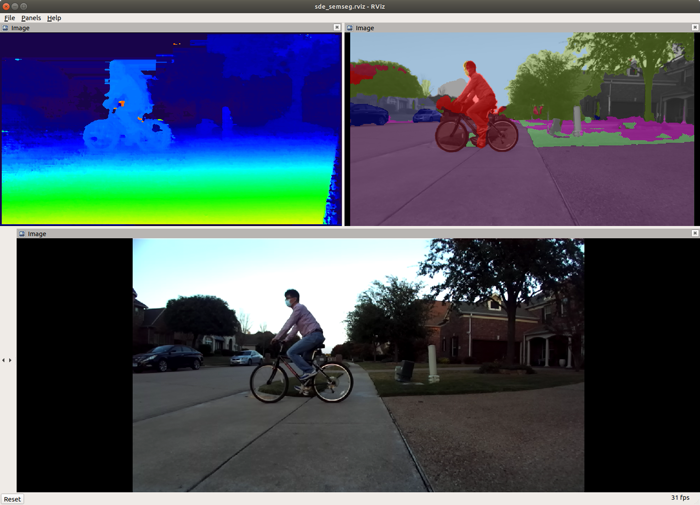

TI OpenVX + ROS Framework & Applications
========================================

### Introduction to TI OpenVX + ROS Development Framework

<figure class="image">
    

    <figcaption> 
Figure 1. TI OpenVX + ROS Framework: Software Stack 
</figcaption>
</figure>

The TI OpenVX + ROS development framework is enabled in a Docker container environment on J7 Processor SDK Linux. We provide detailed steps for setting a Docker container environment for ROS Melodic together with the TI Vision Apps Library (see next section). The TI OpenVX + ROS development framework allows:

- Optimized software implementation of computation-intensive software blocks (including deep-learning, vision, perception, and ADAS) on deep-learning core (C7x/MMA), DSP cores, hardware accelerators built-in on the Jacinto 7 processor
- Application softwares can be complied directly on the Jacinto 7 processor in a Docker container using APIs optimized on Jacinto 7 processor along with many open-source libraries and packages including, for example. OpenCV and Point-Cloud Library (PCL).

Figure below is a representative vision application that can be developed in TI OpenVX + ROS framework.

<figure class="image">
    

    <figcaption> 
Figure 2. Example Application in TI OpenVX + ROS Framework 
</figcaption>
</figure>

### TI Vision Apps Library
The TI Vision Apps Library is a set of APIs for the target deployment that are derived from the Jacinto 7 Processor SDK RTOS, which includes:
- TI OpenVX kernels and infrastructure
- TI deep learning (TIDL) applications
- Imaging and vision applications
- Advanced driver-assistance systems (ADAS) applications
- Perception applications

The TI Vision Apps Library is included in the pre-built package of [J721E Processor SDK RTOS 7.1.0](https://software-dl.ti.com/jacinto7/esd/processor-sdk-rtos-jacinto7/latest/index_FDS.html).

## How to Set Up TI OpenVX + ROS Docker Container Environment on J7 Target
See [LINK](docker/README.md)

## TI OpenVX + ROS Demo Applications

<figure class="image">
    

    <figcaption> 
Figure 3. Demo Applications 
</figcaption>
</figure>

### [Stereo Vision Processing Node Accelerated on LDC and SDE](nodes/ti_sde/README.md)

### [CNN Semantic Segmentation Node with TIDL Running on C7x/MMA](nodes/ti_semseg_cnn/README.md)

## Known Issues

1. Display from insider a Docker container on J7 is not enabled.
2. Ctrl+C termination of a ROS node or a ROS launch session can be sometimes slow and does not fully clean up OpenVX part of implementation. When VX_ERROR happens, it is recommended to reboot the J7 EVM.
2. Stereo Vision Demo
    * Output disparity map may have artifacts that are common to block-based stereo algorithms, e.g., noise in the sky, textureless area, repeated patterns, etc.
    * While the confidence map from SDE has 8 values between 0 (least confident) to 7 (most confident), the confidence map from the multi-layer SDE refinement has only 2 values, 0 and 7. Therefore, it would not appear as fine as the SDE's confidence map.
3. Semantic Segmentation Demo
    * The inference-time accuracy of `ti_semseg_cnn` semantic segmentation CNN is currently not great. This is expected since the CNN network was trained with Cityscapes dataset, and was not re-trained to further optimize the CNN model on the camera data played back from the ROSBAG file.
