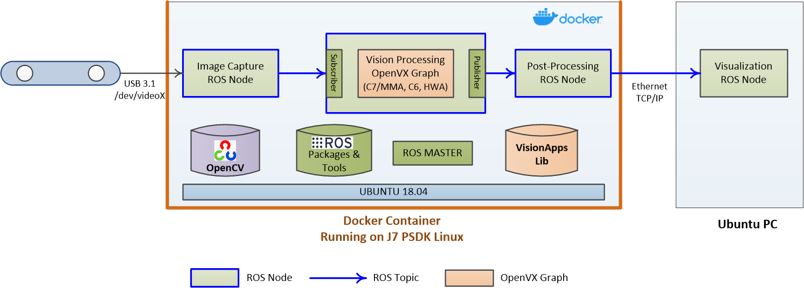

TI OpenVX + ROS Framework & Applications
========================================

## Introduction to TI OpenVX + ROS Framework
[To be added]

## How to Set Up TI OpenVX + ROS Environment
See [this link](docker/README.md)

## TI OpenVX + ROS Example Applications

### [Stereo Vision](nodes/ti_sde/README.md)

### [CNN Semantic Segmentation](nodes/ti_semseg_cnn/README.md)
