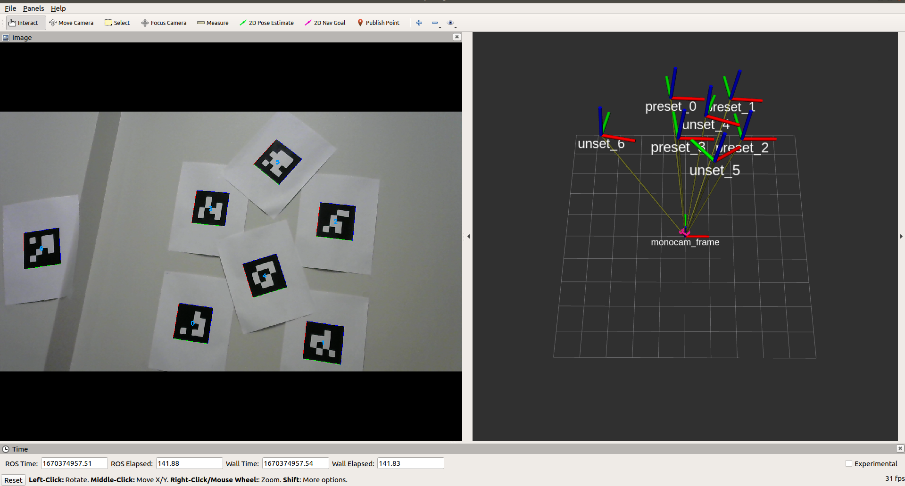

AprilTag ROS Node
==================


<figcaption> Figure 1. RViz display of AprilTag detection outputs on PC </figcaption>
<br />

AprilTag is a robust visual fiducial system, which is used in various applications such as Robotics, localization, SLAM, etc. For more information on AprilTag, is is recommended to visit [https://april.eecs.umich.edu/software/apriltag](https://april.eecs.umich.edu/software/apriltag) and [http://wiki.ros.org/apriltag_ros](http://wiki.ros.org/apriltag_ros). 

This document describes how to install and run AprilTag ROS node in the ROS1 Docker container. It consists of two steps, 1) Install AprilTag library from source, 2) Run AprilTag ROS node with monochrome camera.

## Install AprilTag Library

1. Launch the Docker image. For setting up the ROS1 environment on J7, please follow [Docker Setup for ROS 1](../docker/setting_docker_ros1.md).
    ```
    root@tda4vm-sk:~/j7ros_home# ./docker_run_ros1.sh
    ```

    Before launching `docker_run_ros1.sh`, remove '--rm' flag in `docker run` command in it since we need to commit the changes after installing AprilTag library.

2. Clone AprilTag.
    ```
    root@j7-docker:~/j7ros_home/ros_ws$ export APRILTAG_SOURCE_DIR=$HOME/j7ros_home/apriltag
    root@j7-docker:~/j7ros_home/ros_ws$ git clone https://github.com/AprilRobotics/apriltag.git $APRILTAG_SOURCE_DIR
    ```

3. Build and Install AprilTag library.
    ```
    root@j7-docker:~/j7ros_home/ros_ws$ cd $APRILTAG_SOURCE_DIR
    root@j7-docker:~/j7ros_home/ros_ws$ cmake -B build -DCMAKE_BUILD_TYPE=Release
    root@j7-docker:~/j7ros_home/ros_ws$ cmake --build build --target install
    ```

4. Exit docker and update an image from the container's changes.
    ```
    # Check container_id
    root@tda4vm-sk:~/j7ros_home# docker ps --all

    # Update Docker image
    root@tda4vm-sk:~/j7ros_home# docker commit container_id j7-ros-noetic:8.4
    ```

## Run April ROS Node

1. Launch the Docker image. 
    ```
    root@tda4vm-sk:~/j7ros_home# ./docker_run_ros1.sh
    ```

2. Clone and build AprilTag ROS package.
    ```
    root@j7-docker:~/j7ros_home/ros_ws$ mkdir src
    root@j7-docker:~/j7ros_home/ros_ws$ git clone git clone https://github.com/AprilRobotics/apriltag_ros.git src/apriltag_ros
    root@j7-docker:~/j7ros_home/ros_ws$ catkin_make --source src/apriltag_ros
    ```

3. Launch AprilTag ROS node.
    ```
    root@j7-docker:~/j7ros_home/ros_ws$ source devel/setup.bash
    root@j7-docker:~/j7ros_home/ros_ws$ roslaunch apriltag_ros continuous_detection.launch
    ```

    Note that `tags.yaml` and `settings.yaml` can be configurable for tag definition and tag detection algorithm, respectively. A various types of AprilTags can be downloaded from [https://github.com/AprilRobotics/apriltag-imgs](https://github.com/AprilRobotics/apriltag-imgs).

4. Launch USB camera.

    Connect a USB camera to the SK board. Logitech C920 camera is used for test. Since AprilTag ROS node does not support YUV422 format, we update the following line of `mono_capture.launch` under `/opt/robotics_sdk/ros1/drivers/mono_capture/launch`:
    ```
    <arg name="encoding"               default="bgr8"/> 
    ```

    Then launch the camera as follows: 
    ```
    root@j7-docker:~/j7ros_home/ros_ws$ source devel/setup.bash
    root@j7-docker:~/j7ros_home/ros_ws$ roslaunch mono_capture mono_capture.launch
    ```

    As shown in Figure 1, we can visualize the AprilTag detection outputs along with their poses with respect to the camera using RViz on PC.

