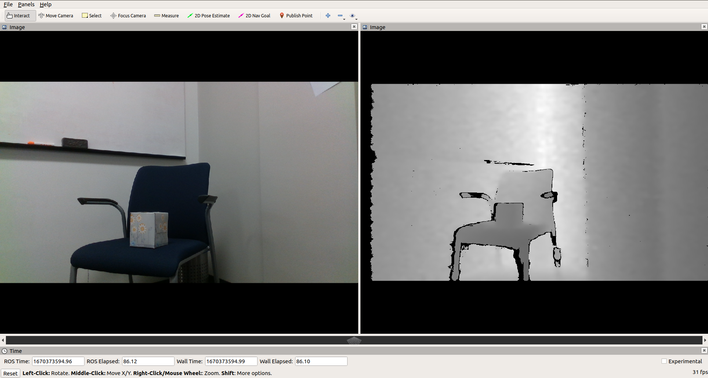

RealSense Camera ROS Node
=========================


<figcaption> Figure 1. RViz display of RealSense camera outputs on PC </figcaption>
<br />

Intel RealSense camera D435i is widely used in many robotics applications that require depth information. This document describes how to install and run the Intel RealSense camera (D435i) ROS node in the ROS 1 Docker container on J7. It consists of two steps:
1. Install RealSense SDK from source.
2. Clone and install the RealSense camera ROS node.

## Install RealSense SDK from Source

1. Launch the Docker image. For setting up the ROS 1 environment on J7, please follow [Docker Setup for ROS 1](../docker/setting_docker_ros1.md).
    ```
    root@am6x-sk:~/j7ros_home# ./docker_run_ros1.sh
    ```

    Before launching `docker_run_ros1.sh`, remove '--rm' flag in `docker run` command in it since we need to commit the changes after installing RealSense SDK.

2. Clone the RealSense SDK.
    ```
    root@j7-docker:~/j7ros_home/ros_ws$ export REALSENSE_SOURCE_DIR=$HOME/j7ros_home/librealsense
    root@j7-docker:~/j7ros_home/ros_ws$ sudo apt-get update
    root@j7-docker:~/j7ros_home/ros_ws$ sudo apt-get install guvcview git libssl-dev libusb-1.0-0-dev pkg-config libgtk-3-dev
    root@j7-docker:~/j7ros_home/ros_ws$ sudo apt-get install libglfw3-dev libgl1-mesa-dev libglu1-mesa-dev
    root@j7-docker:~/j7ros_home/ros_ws$ git clone https://github.com/IntelRealSense/librealsense.git $REALSENSE_SOURCE_DIR
    root@j7-docker:~/j7ros_home/ros_ws$ mkdir $REALSENSE_SOURCE_DIR/build
    root@j7-docker:~/j7ros_home/ros_ws$ cd $REALSENSE_SOURCE_DIR/build

    ```

3. Build and the Install RealSense SDK.
    ```
    # Build SDK
    root@j7-docker:~/j7ros_home/librealsense/build$ export REALSENSE_INSTALL_PREFIX=/opt/realsense
    root@j7-docker:~/j7ros_home/librealsense/build$ sudo mkdir -p $REALSENSE_INSTALL_PREFIX
    root@j7-docker:~/j7ros_home/librealsense/build$ sudo chown $USER:$USER -R $REALSENSE_INSTALL_PREFIX
    root@j7-docker:~/j7ros_home/librealsense/build$ cmake ../ -DFORCE_RSUSB_BACKEND=true -DBUILD_PYTHON_BINDINGS=false -DCMAKE_BUILD_TYPE=release -DBUILD_EXAMPLES=false -DBUILD_GRAPHICAL_EXAMPLES=false -DCMAKE_INSTALL_PREFIX=$REALSENSE_INSTALL_PREFIX

    # Install SDK - It may take up to a couple of hours
    root@j7-docker:~/j7ros_home/librealsense/build$ make install

    # Make cmake config available
    root@j7-docker:~/j7ros_home/librealsense/build$ echo "export realsense2_DIR=/opt/realsense/lib/cmake/realsense2" >> ~/.bashrc
    root@j7-docker:~/j7ros_home/librealsense/build$ source ~/.bashrc

    # Package needed to compile realsense ROS package
    root@j7-docker:~/j7ros_home/librealsense/build$ sudo apt install ros-noetic-ddynamic-reconfigure
    ```

4. Exit Docker and update an image from the container's changes.
    ```
    # Check container_id
    root@am6x-sk:~/j7ros_home# docker ps --all

    # Update Docker image
    root@am6x-sk:~/j7ros_home# docker commit container_id j7-ros-noetic:8.6
    ```

## Run RealSense ROS Node

1. Launch the Docker image.
    ```
    root@am6x-sk:~/j7ros_home# ./docker_run_ros1.sh
    ```

2. Clone the Intel RealSense ROS package.
    ```
    root@j7-docker:~/j7ros_home/ros_ws$ mkdir src
    root@j7-docker:~/j7ros_home/ros_ws$ git clone https://github.com/IntelRealSense/realsense-ros.git src/realsense-ros
    root@j7-docker:~/j7ros_home/ros_ws$ catkin_make --source src/realsense-ros
    ```

3. Launch the RealSense camera.
    Connect a RealSense camera to the SK-board. Then launch the RealSense camera as follows:
    ```
    root@j7-docker:~/j7ros_home/ros_ws$ roslaunch realsense2_camera rs_camera.launch
    ```
    We can visualize the RealSense camera outputs using RViz on PC as shown in Figure 1.