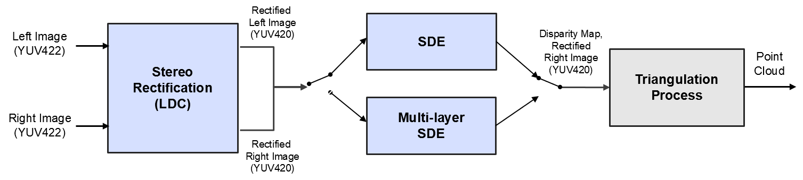

Stereo Vision Application on ROS
================================

It demonstrates the stereo application that uses J7 LDC (Lense Distortion Correction) and DMPAC SDE (Stereo Depth Engine) HWAs. 

LDC first rectifies the unrectified input stereo images using the separate rectification tables for lett and right cameras, respectively, in the format that LDC supports.

Then SDE produces disparity map from the rectified stereo images. Two different disparity estimation modes are supported in the application. One is a single-layer SDE mode, which outputs the raw disparity map from SDE without post processing. The other is a multi-layer SDE refinement mode, which combines the disparity maps produced by SDE at different layers with post processing. Up to 3 layers are supported and these are configurable.  The overall application data flow is shown below.

<figure class="image">
  <center></center>
  <figcaption> <center>Figure 1. Overall stereo application flow </center></figcaption>
</figure>

## Introduction

`ti_sde` directory structure is shown below:
```
ti_sde
.
├── CMakeLists.txt
├── config
│   └── params.yaml
├── docs
│   ├── sde_multilayer_data_flow.png
│   └── ti_sde_data_flow.png
├── launch
│   ├── bag_sde.launch
│   ├── sde.launch
│   └── zed_bag.launch
├── package.xml
├── README.md
└── src
    ├── sde.cpp
    ├── sde.h
    ├── sde_main.cpp
    ├── sde_manage_graph.cpp
    ├── sde_node.cpp
    └── sde_node.h
```

This application can be run by launching sde.launch file, i.e.,
```
roslaunch ti_sde sde.launch
```
It is recommended to launch bag_sde.launch file if a ROSBAG file needs to be played as well.

sde.launch file specifies the followings:
* YAML file that includes algorithm configuration parameters. For the descriptions of important parameters, refer to Parameter section below. For the descriptions of all parameters, please see a yaml file.
* Left input topic name to read left images from a stereo camera.
* Right input topic name to read right images from a stereo camera.
* Output disparity topic name to publish raw disparity maps.

This application publishes the raw disparity map and the color-coded disparity map image and confidence map image, which can be displayed by RViz, are created by launching the ti_viz_nodes application, i.e.,
```
roslaunch ti_viz_nodes viz_disparity.launch
```

## Parameters

 Parameter                | Description                                                                  | Value
--------------------------|------------------------------------------------------------------------------|----------
 left_lut_file_path       | LDC rectification table path for left image                                  | String
 right_lut_file_path      | LDC rectification table path for right image                                 | String
 input_format             | Input image format, 0: U8, 1: YUV422                                         | 0, 1
 width                    | Input image width                                                            | Integer
 height                   | Input image height                                                           | Integer
 sde_algo_type            | SDE algorithm type, 0: sinlge-layer SDE, 1: multi-layer SDE                  | 0, 1
 num_layers               | Number of layers in multi-layer SDE                                          | 2, 3
 sde_confidence_threshold | Disparity with confidence less than this value is invalidated                | 0 ~ 7
 disparity_min            | Minimum disparity to search, 0: 0, 1: -3                                     | 0, 1
 disparity_max            | Maximum disparity to search, 0: 63, 1: 127, 2: 191                           | 0 ~ 2
 pipeline_depth           | OpenVX grpah pipeline depth                                                  | 1 ~ 4

## LDC (Lense Distortion Correction)

As shown in Figure 1, We use the LDC HWA to rectify left and right images. In order to use LDC, the rectification tables should be provided in the format that LDC support. It is a two-step process to create the rectification table in the LDC format.

1. Generation of raw rectification table

    A raw look-up table has `width x height x 2` entries in it, where width and height are the horizontal and vertical sizes of an image, to specify the horizontal and vertical pixel position in a source image that every pixel in a target image maps to. It may consist of two look-up tables of `width x height` for horizontal position and vertical position, respectively. A target image (i.e. rectified image) is created by fetching the pixel in a source image (i.e. unrectified image), which is specified by a raw look up table, for every pixel. For example, OpenCV stereo rectification function generates such a raw rectification table for given camera parameters.

2. Convention of raw rectification table to LDC format

    A raw rectification table is converted to the LDC format by the following pseudo code.

    ```
    // mapX is a raw LUT for horizontal pixel position in Q3 format. Its size is width x height
    // mapY is a raw LUT for vertical pixel position in Q3 format. Its size is width x height
    // ldcLUT is an output LDC format look-up table

    LDC_DS_FACTOR = 4

    sWidth     = width  / LDC_DS_FACTOR + 1;
    sHeight    = height / LDC_DS_FACTOR + 1;
    lineOffset = ((sWidth + 15) & (~15));

    for (i = 0; i < sHeight; i++)
    {
        m = i * LDC_DS_FACTOR;
        if (m > height - 1) {
            m = height - 1;
        }

        for (j = 0; j < sWidth; j++)
        {
            n = j * LDC_DS_FACTOR;
            if (n > width - 1) {
                n = width - 1;
            }

            dx = mapX[m * width + n] - n * 8;
            dy = mapY[m * width + n] - m * 8;

            // Vertical pos comes first followed by horizontal pos
            *ldcLUT++ = (dy & 0xFFFF);
            *ldcLUT++ = (dx & 0xFFFF);
         }

        temp = ((sWidth + 15) / 16) * 16 - sWidth;

        while (temp > 0)
        {
            *ldcLUT++ = 0;
            *ldcLUT++ = 0;
            temp--;
        }
    }
    ```


## SDE (Stereo Depth Engine)

When `sde_algo_type = 0` in params.yaml, the output disparity map is simply the disparity map generated by the SDE HWA without any post processing.

## Multi-Layer SDE Refinement

When `sde_algo_type = 1` in params.yaml, the multi-layer SDE refinement is applied with post processing to improve the disparity map quality. The number of layers is configured by `num_layers` in params.yaml and it should be 2 or 3.

<figure class="image">
  <center></center>
  <figcaption> <center>Figure 2. Multi-layer SDE refinement </center></figcaption>
</figure>

Figure 2 shows the overal block diagram of the multi-layer SDE refinement approach. The rectified stereo pair at full resolution are down-sampled by half to smaller resolutions by the MSC (Multi-Scaler) HWA. The stereo pair at each layers are provided to SDEs to produce the disparity maps at different resolutions. Then the low-resolution disparity map is up-sampled and merged with the high-resolution disparity map successively. The merged disparity map is further processed by hole filling algorithm.
