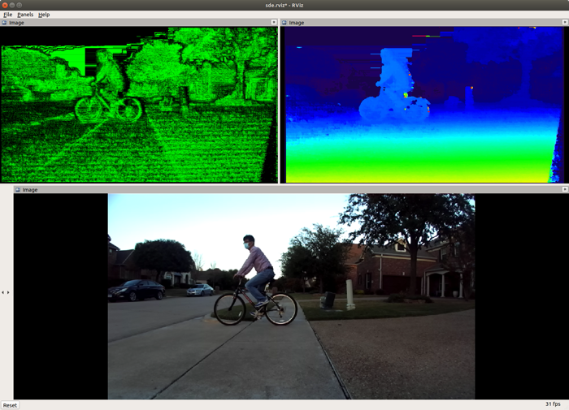
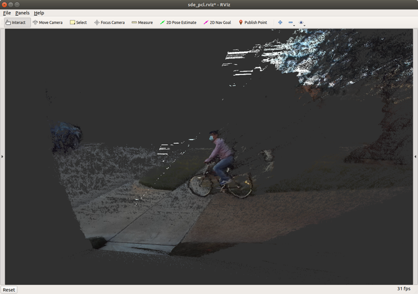
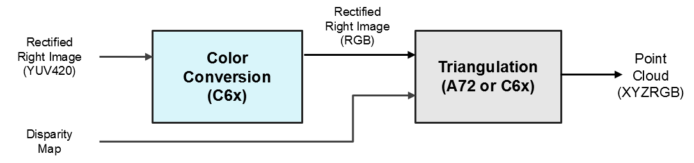

Stereo Vision Application
=========================


<figcaption>Stereo demo: disparity and confidence maps</figcaption>
<br />


<figcaption>Stereo demo: point cloud</figcaption>
<br />

This demonstrates the stereo application that uses J7 LDC (Lens Distortion Correction) and DMPAC SDE (Stereo Depth Engine) hardware accelerators (HWAs). This application outputs not only raw disparity map, but also point-cloud with 3D position, (X,Y,Z) and color information (R,G,B).

Input image format to this application is YUV422:UYVY. The LDC coverts input stereo images to YUV420 (NV12) images, also rectifies the input images using the two rectification tables for left and right cameras, respectively. Note that the rectification tables should be provided in the format that LDC can recognize.

The SDE produces disparity map from the rectified stereo images. Two different disparity estimation modes are supported in this application. One is a "single-layer SDE mode", which outputs the raw disparity map from SDE without post processing. The other is a "multi-layer SDE refinement mode", which combines the disparity maps produced by SDE at different layers with post processing. Up to 3 layers are supported and these are configurable. The overall application data flow is shown in Figure 1.

Finally, when configured, the output disparity map and the rectified right image can be mapped to 3D point cloud by the triangulation process. Each point in the point cloud has 3D position (X, Y, Z) and color information (R, G, B).


<figcaption>Figure 1. Stereo demo: block diagram</figcaption>
<br />

## How to Run the Application in ROS 1

### Run the Stereo Demo
**[J7]** For setting up the ROS1 environment on J7 host, please follow "3.1. Set Up Docker Environment on PC" in [Setting Up Robotics SDK Environment](../../docker/README.md). To launch `ti_sde` node with playing back a ROSBAG file, run the following inside the Docker container on J7 target:
```
roslaunch ti_sde bag_sde.launch
```
To process the image stream from a ZED stereo camera, replace the launch file with `zed_sde.launch`:
```
roslaunch ti_sde zed_sde.launch
```
**[Visualization on Ubuntu PC]** For setting up the ROS1 environment on remote PC, please follow "3.2. Set Up the Ubuntu PC for Visualization" section of [Setting Up Robotics SDK Environment](../../docker/README.md).

To display the disparity map using RViz on PC, run:
```
roslaunch ti_viz_nodes rviz_sde.launch
```

### Run the Stereo Demo with Point-Cloud Enabled
**[J7]** To launch `ti_sde` node with point-cloud enabled on a ROSBAG file, run the following inside the Docker container on J7 target:
```
roslaunch ti_sde bag_sde_pcl.launch
```
To process the image stream from a ZED stereo camera, replace the launch file with `zed_sde.launch`:
```
roslaunch ti_sde zed_sde_pcl.launch
```
**[Visualization on Ubuntu PC]**  To display the point-cloud data using RViz on PC, run:
```
roslaunch ti_viz_nodes rviz_sde_pcl.launch
```

## How to Run the Application in ROS 2

### Run the Stereo Demo
**[J7]** For setting up the ROS2 environment on J7 host, please follow "4.1. Set Up Docker Environment on PC" in [Setting Up Robotics SDK Environment](../../docker/README.md). To launch `ti_sde` node with playing back a ROSBAG file, run the following inside the Docker container on J7 target:
```
ros2 launch ti_sde bag_sde_launch.py
```
To process the image stream from a ZED stereo camera, replace the launch file with `zed_sde_launch.py`:
```
ros2 launch ti_sde zed_sde_launch.py
```
**[Visualization on Ubuntu PC]** For setting up the ROS2 environment on remote PC, please follow "4.2. Set Up the Ubuntu PC for Visualization" section of [Setting Up Robotics SDK Environment](../../docker/README.md)

To display the disparity map using RViz on PC, run:
```
ros2 launch ti_viz_nodes rviz_sde_launch.py
```

### Run the Stereo Demo with Point-Cloud Enabled
**[J7]** To launch `ti_sde` node with point-cloud enabled on a ROSBAG file, run the following inside the Docker container on J7 target:
```
ros2 launch ti_sde bag_sde_pcl_launch.py
```
To process the image stream from a ZED stereo camera, replace the launch file with `zed_sde_pcl_launch.py`:
```
ros2 launch ti_sde zed_sde_pcl_launch.py
```
**[Visualization on Ubuntu PC]**  To display the point-cloud data using RViz on PC, run:
```
ros2 launch ti_viz_nodes rviz_sde_pcl_launch.py
```

## Launch File Parameters

Parameter          | Description                                                               | Value
-------------------|---------------------------------------------------------------------------|-------------------
rosparam file      | Algorithm configuration parameters (see "ROSPARAM Parameters" section)    | config/params.yaml
enable_pc          | Enable point-cloud. This overrides setting in `config/params.yaml`        | 0, 1
left_input_topic   | Subscribe topic name for left camera image                                | camera/left/image_raw
right_input_topic  | Subscribe topic name for right camera image                               | camera/right/image_raw
camera_info_topic  | Subscribe topic name for right camera info                                | camera/right/camera_info
disparity_topic    | Publish topic name topic for raw disparity                                | camera/disparity/raw
point_cloud_topic  | Publish topic name for point cloud                                        | point_cloud

## ROSPARM Parameters

### Basic input, LDC and SDE Parameters

Parameter                | Description                                                         | Value
-------------------------|---------------------------------------------------------------------|----------
left_lut_file_path       | LDC rectification table path for left image                         | String
right_lut_file_path      | LDC rectification table path for right image                        | String
input_format             | Input image format, 0: U8, 1: YUV422                                | 0, 1
sde_algo_type            | SDE algorithm type, 0: single-layer SDE, 1: multi-layer SDE         | 0, 1
num_layers               | Number of layers in multi-layer SDE                                 | 2, 3
disparity_min            | Minimum disparity to search, 0: 0, 1: -3                            | 0, 1
disparity_max            | Maximum disparity to search, 0: 63, 1: 127, 2: 191                  | 0, 1, 2
stereo_baseline          | Stereo camera baseline in meter                                     | Float32

### Point Cloud Parameters

Parameter                | Description                                                         | Value
-------------------------|---------------------------------------------------------------------|----------
enable_pc                | Flag to enable/disable point cloud creation                         | 0, 1
use_pc_config            | Flag to use the following point cloud configurations                | 0, 1
sde_confidence_threshold | Disparity with confidence less than this value is invalidated       | Integer, [0, 7]
point_low_x              | Min X position of a point to be rendered                            | Float32
point_high_x             | Max X position of a point to be rendered                            | Float32
point_low_y              | Min Y position of a point to be rendered                            | Float32
point_high_y             | Max Y position of a point to be rendered                            | Float32
point_low_z              | Min Z position of a point to be rendered                            | Float32
point_high_z             | Max Z position of a point to be rendered                            | Float32

## Processing Blocks

### LDC (Lense Distortion Correction)
As shown in Figure 1, we use the LDC HWA to rectify left and right images. In order to use LDC, the rectification tables should be provided in the format that LDC supports. We provide a Python tool for generate LDC rectification tables for ZED stereo camera. For details, please see [drivers/zed_capture/README.md](../../drivers/zed_capture/README.md). For information, below is the two-step process for generating the rectification table:

1. Generation of raw rectification table

    A raw look-up table has `width x height x 2` entries in it, where width and height are the horizontal and vertical sizes of an image, to specify the horizontal and vertical pixel position in a source image that every pixel in a target image maps to. It may consist of two look-up tables of `width x height` for horizontal position and vertical position, respectively. A target image (i.e. rectified image) is created by fetching the pixel in a source image (i.e. unrectified image), which is specified by a raw look up table, for every pixel. For example, OpenCV stereo rectification function generates such a raw rectification table for given camera parameters.

2. Convention of raw rectification table to LDC format

    A raw rectification table is converted to the LDC format by the following pseudo code.

    ```
    // mapX is a raw LUT for horizontal pixel position in Q3 format. Its size is width x height
    // mapY is a raw LUT for vertical pixel position in Q3 format. Its size is width x height
    // ldcLUT is an output LDC format look-up table

    LDC_DS_FACTOR = 4

    sWidth     = width  / LDC_DS_FACTOR + 1;
    sHeight    = height / LDC_DS_FACTOR + 1;
    lineOffset = ((sWidth + 15) & (~15));

    for (i = 0; i < sHeight; i++)
    {
        m = i * LDC_DS_FACTOR;
        if (m > height - 1) {
            m = height - 1;
        }

        for (j = 0; j < sWidth; j++)
        {
            n = j * LDC_DS_FACTOR;
            if (n > width - 1) {
                n = width - 1;
            }

            dx = mapX[m * width + n] - n * 8;
            dy = mapY[m * width + n] - m * 8;

            // Vertical pos comes first followed by horizontal pos
            *ldcLUT++ = (dy & 0xFFFF);
            *ldcLUT++ = (dx & 0xFFFF);
         }

        temp = ((sWidth + 15) / 16) * 16 - sWidth;

        while (temp > 0)
        {
            *ldcLUT++ = 0;
            *ldcLUT++ = 0;
            temp--;
        }
    }
    ```

### SDE (Stereo Depth Engine)
When `sde_algo_type = 0` in `params.yaml`, the output disparity map is simply the disparity map generated by the SDE HWA without any post processing.

#### Multi-Layer SDE Refinement
When `sde_algo_type = 1` in `params.yaml`, the multi-layer SDE refinement is applied with post processing to improve the quality of the disparity map. The number of layers is configured by `num_layers` in `params.yaml`, and it should be 2 or 3.


<figcaption>Figure 2. Multi-layer SDE refinement</figcaption>
<br />

Figure 2 shows the overall block diagram of the multi-layer SDE refinement approach. The rectified stereo pair at full resolution are down-sampled by half to smaller resolutions by the MSC (Multi-Scaler) HWA. The stereo pair at each layers are provided to SDEs to produce the disparity maps at different resolutions. Then the low-resolution disparity map is up-sampled and merged with the high-resolution disparity map successively. The merged disparity map is further processed by hole-filling algorithm.

### Point Could Generation
This process produces point cloud from the raw disparity map (output of SDE) and the rectified right image (output of LDC). The point could generation process consists of two functional blocks, color conversion and triangulation, as shown in the below figure.


<figcaption>Figure 3. Point could generation</figcaption>
<br />

The color conversion block converts the format of the rectified right image to RGB, and the RGB image goes to the triangulation block. The triangulation block takes this RGB image and raw disparity map as inputs to produce the point cloud in the `(X, Y, Z, R, G, B)` format.

Every disparity value whose confidence is larger than or equal to `sde_confidence_threshold` is mapped to 3D position with the corresponding color information. For a pixel at `(x, y)` on image, let's say `d` is its disparity, `b` is baseline, and `(dcx, dcy)` is distortion center. Then, its 3D position. `(X, Y, Z)` is computed as follows:
```
Z =  bf / d
X =  (x - dcx) x b / d
Y = -(y - dcy) x b / d
```

The 3D point out of the region specified by `point_low_{x/y/z}` and `point_high_{x/y/z}` are discarded. Note that the color conversion block runs on DSP and the triangulation block runs on either DSP and A72.

## Known Issues
1. Output disparity map may have artifacts that are common to block-based stereo algorithms, e.g., noise in the sky, texture-less area, repeated patterns, etc.
2. While the confidence map from SDE has 8 values between 0 (least confident) to 7 (most confident), the confidence map from the multi-layer SDE refinement has only 2 values, 0 and 7. Therefore, it would not appear as fine as the SDE's confidence map.
3. SDE HWA supports input resolution up to 2048x1024 with 192 disparity search ranges. However, in this release, SDE only supports up to 1280x720 with 128 disparity search range.
