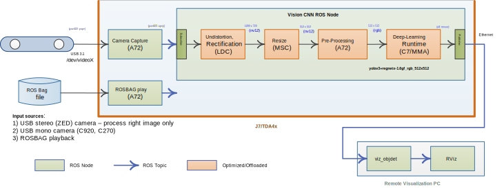

Vision CNN: Object Detection
============================


<br />

This `ti_vision_cnn` node is versatile deep-learning (DL) inference ROS node that is optimized on DL cores and hardware accelerator of TDA4. The `ti_vision_cnn` node supports compute-intensive DL inference operations including 2D object detection and semantic segmentation. Figure 1 shows the high-level block diagram of the applications around the `ti_vision_cnn` node, which consists of multiple processing blocks that are deployed on hardware accelerators and DSP processors for pre-processing and post-processing in an optimized manner.


<figcaption>Figure 1. Object detection demo: block diagram</figcaption>
<br />

For details of block diagram and parameters of `ti_vision_cnn`, please refer to [README.md](./README.md).

## Object Detection Demo

### How to Run the Application in ROS 1

**[TDA4]** To launch object detection demo with playing back a ROSBAG file, run the following inside the Docker container on TDA4 target:
```
roslaunch ti_vision_cnn bag_objdet_cnn.launch
```
To process the image stream from a ZED stereo camera:
```
roslaunch ti_vision_cnn zed_objdet_cnn.launch zed_sn:=SNxxxxx
```
To process the image stream from a USB mono camera:
```
roslaunch ti_vision_cnn mono_objdet_cnn.launch
# Alternatively
roslaunch ti_vision_cnn gscam_objdet_cnn.launch
```

For IMX390 camera as input, depending on choice of resolution, run one from the following:
```
roslaunch ti_vision_cnn gscam_objdet_cnn_imx390.launch width:=1920 height:=1080
roslaunch ti_vision_cnn gscam_objdet_cnn_imx390.launch width:=1280 height:=720
roslaunch ti_vision_cnn gscam_objdet_cnn_imx390.launch width:=960 height:=540
```

**[Visualization on Ubuntu PC]** For setting up environment of the remote PC, please follow [Docker Setup for ROS 1](../../../docker/setting_docker_ros1.md)

To launch visualization:
```
roslaunch ti_viz_nodes rviz_objdet_cnn.launch
```

For IMX390 camera, depending on the resolution from the TDA4, run one from the following:
```
roslaunch ti_viz_nodes rviz_objdet_cnn.launch width:=1920 height:=1080
roslaunch ti_viz_nodes rviz_objdet_cnn.launch width:=1280 height:=720
roslaunch ti_viz_nodes rviz_objdet_cnn.launch width:=960 height:=540
```

### How to Run the Application in ROS 2

**[TDA4]** To launch object detection demo with a ZED stereo camera, run the following inside the Docker container on TDA4 target:
```
ros2 launch ti_vision_cnn zed_objdet_cnn_launch.py zed_sn:=SNxxxxx
```
To process the image stream from a USB mono camera:
```
roslaunch ti_vision_cnn mono_objdet_cnn.launch
# Alternatively
roslaunch ti_vision_cnn gscam_objdet_cnn.launch
```
<!-- To launch object detection demo with playing back a ROSBAG file, run the following inside the Docker container on TDA4 target:
```
ros2 launch ti_vision_cnn bag_objdet_cnn_launch.py
``` -->

Launch example for IMX390 camera is to be added later for ROS 2.

**[Visualization on Ubuntu PC]** For setting up environment of the remote PC, please follow [Docker Setup for ROS 2](../../../docker/setting_docker_ros2.md)

```
ros2 launch ti_viz_nodes rviz_objdet_cnn_launch.py
```
