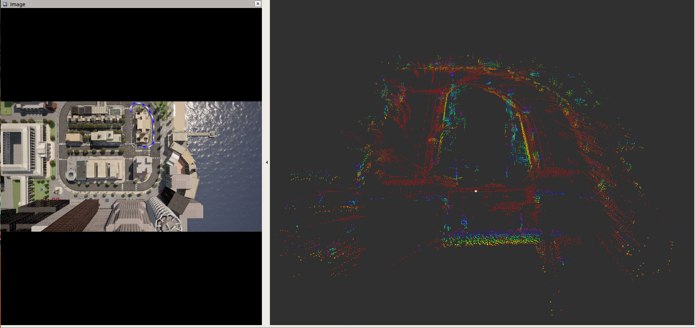

Visual Localization Application
================================



This application performs the ego vehicle localization that estimates an ego vehicle's 6-DOF (Degree of Freedom) pose from calibrated camera images using a 3D sparse map created offline. The 3D sparse map consists of a set of key points with (X, Y, Z) positions and 64-dimensional descriptors. To localize the ego vehicle's pose, key points are detected with descriptors from the input camera image and these key points are matched against the key points in the map. The ego vehicle's pose is estimated using the Perspective-n-Point (PnP) approach.     

Key-point descriptor plays critical role in the visual localization. In this demo, we use a deep neural network to learn hand computed feature descriptor like KAZE in a supervised manner. We refer such descriptor as DKAZE. The DAKZE network was used to create key features and their descriptors for the sparse 3D map and is also used to detect key feature points with descriptors for every input image in the localization process. For more details about the DKAZE network and the localization process, refer to [Vision Apps User Guide](https://software-dl.ti.com/jacinto7/esd/processor-sdk-rtos-jacinto7/latest/exports/docs/vision_apps/docs/user_guide/group_apps_dl_demos_app_tidl_vl.html).

For this demo, we provide the data set that has been created using Carla simulator. This data set includes an input rosbag file and the sparse 3D map crated offline, etc. The input rosbag file consists of a sequence of images in YUV422 (UYVY) format. Since the sparse 3D map should cover the area where the input image is being captured for localization. This demo does not work for live camera input with the provided sparse 3D map.   
   


<figcaption>Figure 1. Visual Localization demo: block diagram</figcaption>
<br />

## How to Run the Application in ROS1

### Run the Visual Localization Demo
**[J7]** For setting up the ROS1 environment on J7 host, please follow "3.1. Set Up Docker Environment on PC" in [Setting Up Robotics SDK Environment](../../docker/README.md). To launch `ti_vl` node with playing back a ROSBAG file, run the following inside the Docker container on J7 target:
```
roslaunch ti_vl bag_vlsloc.launch
```
**[Visualization on Ubuntu PC]** For setting up the ROS1 environment on remote PC, please follow "3.2. Set Up Docker Environment on PC" in [Setting Up Robotics SDK Environment](../../docker/README.md).

To display the top-down image with overlaid vehicle trajectory and pose in 3D space using RViz on PC, run:
```
roslaunch ti_vl rviz.launch
```

## How to Run the Application in ROS2

### Run the Visual Localization Demo
**[J7]** For setting up the ROS2 environment on J7 host, please follow "4.1. Set Up Docker Environment on PC" in [Setting Up Robotics SDK Environment](../../docker/README.md). To launch `ti_vl` node with playing back a ROSBAG file, run the following inside the Docker container on J7 target:
```
ros2 launch ti_vl bag_visloc_launch.py
```
**[Visualization on Ubuntu PC]** For setting up the ROS2 environment on remote PC, please follow "4.2. Set Up Docker Environment on PC" in [Setting Up Robotics SDK Environment](../../docker/README.md).

To display the top-down image with overlaid vehicle trajectory and pose in 3D space using RViz on PC, run:
```
ros2 launch ti_viz_nodes rviz_launch.py
```

## Launch File Parameters

Parameter          | Description                                                                  | Value
-------------------|------------------------------------------------------------------------------|-------------------
rosparam file      | Algorithm configuration parameters (see "ROSPARAM Parameters" section)       | config/params.yaml
input_topic        | Subscribe topic name for input camera image                                  | camera/image_raw
out_image_topic    | Publish topic name topic for top-down image with overlaid vehicle trajectory | vis_localize/out_image
out_pose_topic     | Publish topic name topic for vehicle pose                                    | vis_localize/pose
map_topic          | Publish topic name for feature points in offline map                         | vis_localize/map

## ROSPARM Parameters

### Basic input, DL model Parameters

Parameter                | Description                                                          | Value
-------------------------|----------------------------------------------------------------------|----------
input_format             | Input image format, 0: YUV420, 1: YUV422                             | 0, 1
lut_file_path            | LDC rectification table path                                         | String
dl_model_path            | Path to the feature detection DL model                               | String
width                    | Input image width                                                    | Integer
height                   | Input image height                                                   | Integer
out_width                | Output semantic segmentation output (tensor) width                   | Integer
out_height               | Output semantic segmentation output (tensor) height                  | Integer
pipeline_depth           | OpenVX graph pipeline depth                                          | 1 ~ 8


### Visual Localization Parameters

The following shows the parameters necessary for visual localization. The default values are for the test data from a Carla simulator that we provide.

Parameter                | Description                                                          | Value
-------------------------|----------------------------------------------------------------------|----------
top_view_img_path        | Path to top-down view image, on which vehicle trajectory is overlaid | String
input_voxel_info_path    | Path to voxel info binary file                                       | String
input_map_feat_pt_path   | Path to binary file that has map key points' 3D position             | String
input_map_feat_desc_path | Path to binary file that has map key points' descriptor              | String
input_upsample_wt_path   | Path to binary file that has upsampling coefficients for descriptor  | String
input_upsample_bias_path | Path to binary file that has upsampling bias for descriptor          | String
score_th                 | Score threshold for picking good key points                          | Integer
num_map_feat:            | Number of key points in a map                                        | Integer
max_frame_feat           | Max number of key points for a frame                                 | Integer
num_voxels               | Number of voxels                                                     | Integer
filter_scale_pw2         | Scale of filter coefficients for input_upsample_wt_path              | Integer
hi_res_desc_scale_pw2    | Scale of descriptors for input_map_feat_desc_path                    | Integer 
pose_calc_skip_flag      | Pose calculation skip flag (Should be 0)                             | 0, 1

## Processing Blocks

Referring to Figure 1, below are the descriptions of the processing blocks implemented in this application:

1. The first step is to process input images. J7 LDC (Lens Distortion Correction) hardware accelerator (HWA) changes image format as well a removes lense distortion. The input format to the application is  YUV422 (UYVY) format. It is converted to YUV420 (NV12) by the LDC.
2. Input images are resized to a smaller resolution, which is specified by `dl_width` and `dl_height` in `params.yaml`, for the DKAZE network. The MSC (Multi-Scaler) HWA resizes the images to a desired size. 
3. The pre-processing block converts YUV420 (NV12) to RGB, which is expected input format for the DKAZE network.
4. The DKAZE network is accelerated by C7x/MMA with DLR runtime, and outputs feature score tensor and feature descriptor tensor.
5. Two output tensors from the DAKZE network go to the pose calculation (PoseCalc) block, which runs on C6x. This block estimates the ego-vehicle's pose. 
6. The estimate pose goes to the pose visualization (PoseViz) block, which runs on C6x too. This block creates the top-down output image with overlaid vehicle's trajectory. This output image is published along with the estimated pose.


## Known Issues
1. The provided sparse 3D map is for the input bag file we provide. Both the input bag file and the sparse 3D map are created using Calra simulator. Since the sparse 3D map should cover the area where the input image is being captured for localization. This demo does not work for live camera input with the provided sparse 3D map.   