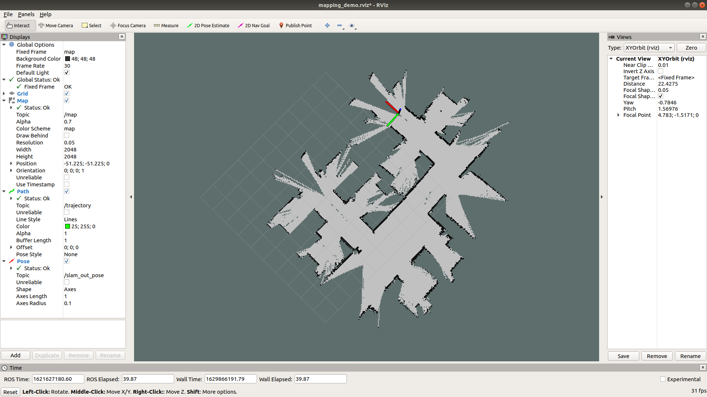

Hector SLAM Application
========================


<figcaption> Figure 1. 2D Lidar map using Hector SLAM </figcaption>
<br />

SLAM (Simultaneous Localization and Mapping) is a critical technology in Robotics applications. It helps map unknown environment and localize a robot using a pre-built map. There are many open-source SLAM algorithms with camera and 2D/3D Lidar and they can run on J7 in Docker container. For example, in this demo, it is demonstrated how to build and run Hector SLAM on J7 in Docker container. 2D Lidar data, which was collected from TurtleBot3 is provided for this demo.

Figure 1 shows the output map by Hector SLAM on the 2D Lidar data from TurtleBot3. For more details on Hector SLAM, please refer to [http://wiki.ros.org/hector_slam](http://wiki.ros.org/hector_slam).

## How to Run the Hector SLAM Application

### Run the Hector SLAM on J7

1. Download 2D Lidar data.
    ```
    root@tda4vm-sk:~/j7ros_home$ make lidar2d_download
    ```
    2D Lidar data is saved in $HOME/j7ros_home/data/lidar2d.

2. Clone the Hector SLAM git repository. Run the followings on the J7 host Linux:
    ```
    root@tda4vm-sk:~/j7ros_home$ export SLAM_ROOT=/opt/robotics_sdk/ros1/slam
    root@tda4vm-sk:~/j7ros_home$ $SLAM_ROOT/j7_setup_hector_slam.sh
    ```
    It clones the Hector SLAM git repository and applies the patch to run it on the 2D Lidar data provided.

3. Launch the Docker image. For setting up the ROS1 environment on J7 host, please follow [Docker Setup for ROS 1](../../docker/setting_docker_ros1.md).
    ```
    root@tda4vm-sk:~/j7ros_home$ ./docker_run_ros1.sh
    ```

4. Compile the Hector SLAM inside the Docker container:
    ```
    root@tda4vm-sk:~/j7ros_home/ros_ws$ catkin_make --source /opt/robotics_sdk/ros1 --force-cmake
    ```

5. Run the hector SLAM
    ```
    root@tda4vm-sk:~/j7ros_home/ros_ws$ roslaunch hector_slam_launch tutorial_j7.launch
    ```

### Visualize map and pose on Ubuntu PC

For setting up the ROS1 environment on the remote PC, please follow [Docker Setup for ROS 1](../../docker/setting_docker_ros1.md).

1. As done on the J7 host Linux, clone the Hector SLAM git repository:
    ```
    user@pc:~/j7ros_home$ export SLAM_ROOT=$HOME/j7ros_home/ros_ws/src/robotics_sdk/ros1/slam
    user@pc:~/j7ros_home$ $SLAM_ROOT/j7_setup_hector_slam.sh
    ```

2. Launch the Docker image.
    ```
    user@pc:~/j7ros_home$ ./docker_run_ros1.sh
    ```

3. Compile the Hector SLAM:
    ```
    root@pc-docker:~/j7ros_home/ros_ws$ catkin_make --source ./src/robotics_sdk/ros1/slam/hector_slam
    ```

4. To display map and pose, run:
    ```
    root@pc-docker:~/j7ros_home/ros_ws$ roslaunch hector_slam_launch map_rviz.launch
    ```


